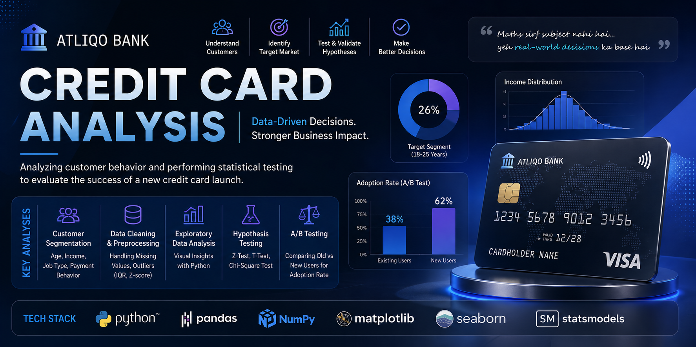

  

  
  
  
  
  
  

  
  

# 🏦 Atliiqo Bank Credit Card Analysis

Data-driven analysis of credit card adoption using statistics, A/B testing, and customer segmentation.

## 📌 Overview
This project analyzes whether a **new credit card by Atiliqo Bank** can succeed in a competitive market (Axis, HDFC, ICICI).

The focus is on **data-driven decision making** using statistics and real-world analysis.

---

## 🎯 Problem Statement
Atiliqo Bank wants to launch a new credit card in India.  
However, due to strong competition, the bank needs to answer:

👉 Which customer segment should be targeted?  
👉 Will users actually adopt the new card?  

---

## 🧠 Approach

### 🔹 Phase 1: Target Market Analysis
- Data cleaning & preprocessing  
- Handling missing values (median strategy)  
- Outlier detection (IQR, Z-score)  
- Exploratory Data Analysis (EDA)  
- Visualization of:
  - Age groups  
  - Income distribution  
  - Job types  
  - Payment methods  

---

### 🔹 Phase 2: Experimentation & Testing
- Users divided into:
  - Old (existing) users  
  - New users  

- Applied:
  - A/B Testing  
  - Hypothesis Testing  
  - Z-Test  
  - T-Test  
  - Chi-Square Test  

- Concepts used:
  - Central Limit Theorem  
  - Normal Distribution  
  - Confidence Interval  
  - P-values  
  - Type 1 & Type 2 Errors  
  - Effect Size  

---

## ⚙️ Tech Stack
- Python  
- Pandas, NumPy  
- Matplotlib, Seaborn  
- SciPy / Statsmodels  
- Jupyter Notebook  

---

## 📂 Project Structure

Atiliqo-Bank-Project

├── dataset/

├── phase_1_atliqo_bank.ipynb

├── phase_2_atliqo_bank.ipynb

├── Other/

├── Central_Limit_therom.ipynb

├── z_test_hypothesis_testing_assignment.ipynb

├── t test.ipynb

├── abtesting.ipynb

└── README.md

---

## 📊 Key Learnings
- Statistics is not just theory — it directly impacts business decisions  
- A/B testing helps validate real-world assumptions  
- Proper data cleaning & preprocessing is crucial before analysis  

---

## 🚀 Highlights
✔ End-to-end Data Science workflow  
✔ Strong use of statistical concepts in real scenarios  
✔ Hands-on implementation of hypothesis testing  

---

## 🔮 Future Improvements
- Use real-world datasets  
- Build predictive ML model  
- Deploy dashboard (Streamlit / Power BI)

---

## 🤝 Connect
Feel free to connect or share feedback!

---

⭐ If you like this project, give it a star!
